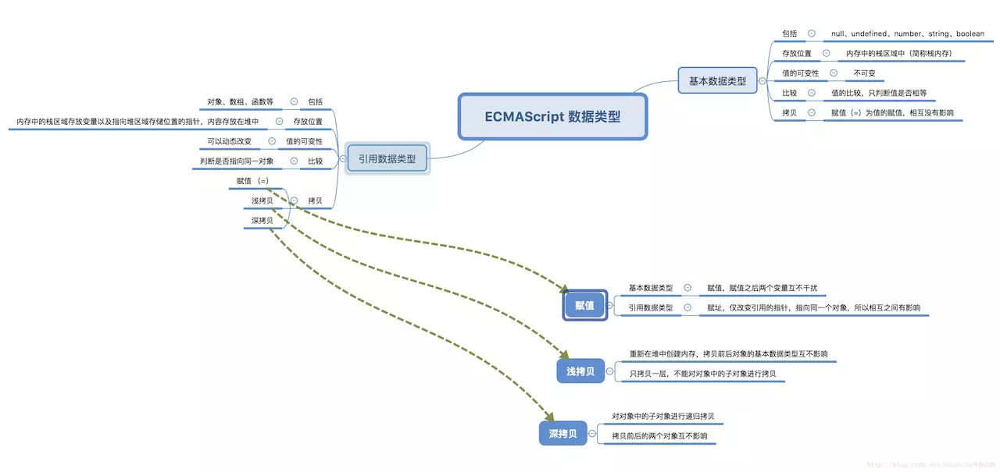

[面试系列（一）- 浅拷贝与深拷贝 | 掘金技术征文](https://github.com/danygitgit/document-library)
===
> create by **db** on **2020-3-26 19:35:50**   
> Recently revised in **2020-3-28 13:54:41**
> 
**闲时要有吃紧的心思，忙时要有悠闲的趣味**

<a name="chapter-menu" id="chapter-menu">目录</a>

- [前言](#chapter-1)

- [正文](#chapter-2)

  - [一、ECMAScript 的数据类型](#chapter-2-1)
  - [二、浅拷贝和深拷贝初探](#chapter-2-2)
  - [三、浅拷贝的实现](#chapter-2-3)
    - [Object.assign()](#chapter-2-3-2) 
    - [Array.prototype.concat()](#chapter-2-3-3) 
    - [Array.prototype.slice()](#chapter-2-3-4) 
    - [...  展开运算符](#chapter-2-3-5)
    - [手写浅拷贝](#chapter-2-3-1)
  - [四、 深拷贝的实现](#chapter-2-4) 
    - [JSON.parse(JSON.stringify())](#chapter-2-4-2) 
    - [函数库 Lodash](#chapter-2-4-3) 
    - [框架 jQuery](#chapter-2-4-4) 
    - [手写深拷贝](#chapter-2-4-1) 

- [总结](#chapter3) 

# <a name="chapter-1" id="chapter-1">前言</a>

> [返回目录](#chapter-menu)

&emsp;白驹过隙，时光荏苒，转眼春暖花开。2020年注定让我们铭记！清明将至，新冠病毒的肆虐已接近尾声，复工复学潮即将到来。愿岁月静好，山河无恙！

&emsp;又到了一年的金三银四，想要换工作的同学自然不能错过。今年的你面试了吗，去了哪个厂？2020年春招正在进行中，不知道各位应（xin）届（si）生（ji）是否已经找到了自己心仪的公司。也不知道各位技术（lao）大（si）佬（ji）是否又弯道超车，成功跳槽。或者你想起了当年也是这样面试的自己，有过怎样的经历，是否还记得当年我们一起搜罗过的面试经验，刷过的题库？

&emsp;无论跳槽与否，居安思危，多备口罩（大雾……）——— 多个准备总是没错的。

&emsp;下面我们就开始准备我们的面试必考题之一 —— **浅拷贝与深拷贝**。

# <a name="chapter-2" id="chapter-2">正文</a>

&emsp;话不多说，祭图：

## <a name="chapter-2-1" id="chapter-2-1">一、ECMAScript 的数据类型
</a>

> [返回目录](#chapter-menu)

&emsp;`数据类型`是我们多数人学习JS得第一课，是拷贝操作最基本也是最重要的知识，让我们复习一下吧。

# <a name="chapter3" id="chapter3">总结</a>

> [返回目录](#chapter-menu)

&emsp;浅拷贝与深拷贝，无论在日常工作还是面试准备中都是避免不了的知识点，虽然不必将其中的所有方法和原理全部记住，但是知其然也要知其所以然。要是面试官忽然让你手写深拷贝也不至于太尴尬不是……

&emsp;另外，尺有所短寸有所长，无关乎好坏优劣，其实每种方法都有自己的优缺点，和适用场景，人尽其才，物尽其用，方是真理。

<!-- 下面对各种方法进行对比，希望给大家提供一些帮助

clone	cloneJSON	cloneLoop	cloneForce
难度	☆☆	☆	☆☆☆	☆☆☆☆
兼容性	ie6	ie8	ie6	ie6
循环引用	一层	不支持	一层	支持
栈溢出	会	会	不会	不会
保持引用	否	否	否	是
适合场景	一般数据拷贝	一般数据拷贝	层级很多	保持引用关系 -->

* **参考文献**：

1. [Lodash clone 系列](https://lodash.net/docs/4.16.1.html#_clonevalue)
2. [浅拷贝与深拷贝](https://juejin.im/post/5b5dcf8351882519790c9a2e)
3. [深拷贝的终极探索](https://yanhaijing.com/javascript/2018/10/10/clone-deep/)
4. [深拷贝与浅拷贝的实现（一）](http://www.alloyteam.com/2017/08/12978/)
5. [深入浅出深拷贝与浅拷贝](https://juejin.im/post/5c6ffac85188252e46626b92)
6. [什么是 js 深拷贝和浅拷贝及其实现方式](https://www.haorooms.com/post/js_copy_sq)
7. [JavaScript 浅拷贝和深拷贝](https://www.kancloud.cn/ljw789478944/interview/397319)
8. [js 深拷贝 vs 浅拷贝](https://juejin.im/post/59ac1c4ef265da248e75892b)
9. [深拷贝的终极探索（99%的人都不知道）](https://segmentfault.com/a/1190000016672263)
10. [面试题之如何实现一个深拷贝](https://www.muyiy.cn/blog/4/4.3.html#引言)
11. [浅拷贝和深拷贝（较为完整的探索）](https://juejin.im/post/5da7c76a6fb9a04ddc625014)

 
**后记：Hello 小伙伴们，如果觉得本文还不错，记得点个赞或者给个 star，你们的赞和 star 是我编写更多更丰富文章的动力！[GitHub 地址](https://github.com/danygitgit/document-library)**

# 文档协议 
>  <a xmlns:dct="http://purl.org/dc/terms/" property="dct:title">**db** 的文档库</a> 由 <a xmlns:cc="http://creativecommons.org/ns#" href="db" property="cc:attributionName" rel="cc:attributionURL">db</a> 采用 <a rel="license" href="http://creativecommons.org/licenses/by-nc-sa/4.0/">知识共享 署名-非商业性使用-相同方式共享 4.0 国际 许可协议</a>进行许可。 基于<a xmlns:dct="http://purl.org/dc/terms/" href="https://github.com/danygitgit" rel="dct:source">https://github.com/danygitgit</a>上的作品创作。 本许可协议授权之外的使用权限可以从 <a xmlns:cc="http://creativecommons.org/ns#" href="https://creativecommons.org/licenses/by-nc-sa/2.5/cn/" rel="cc:morePermissions">https://creativecommons.org/licenses/by-nc-sa/2.5/cn/</a> 处获得。

